# Project Overview &nbsp;  📜 
 Unifolio is a customizable portfolio template tailored for university students and beginners. Inspired by advanced-level developer portfolios, project addresses common pain points and integrates insights from recruiters to meet their expectations effectively.

 ### Live Project Link: 

⭐️   https://unifolio-delta.vercel.app/  ⭐️
##

<br>
<br>

## Getting Started &nbsp;  ⚙️

<br>
First, install packages run the development server 

```bash
npm install && npm run dev
```

Open [http://localhost:3000](http://localhost:3000) with your browser to see the result.

If you see this, you are ready to start turning this template into your own portfolio 👌

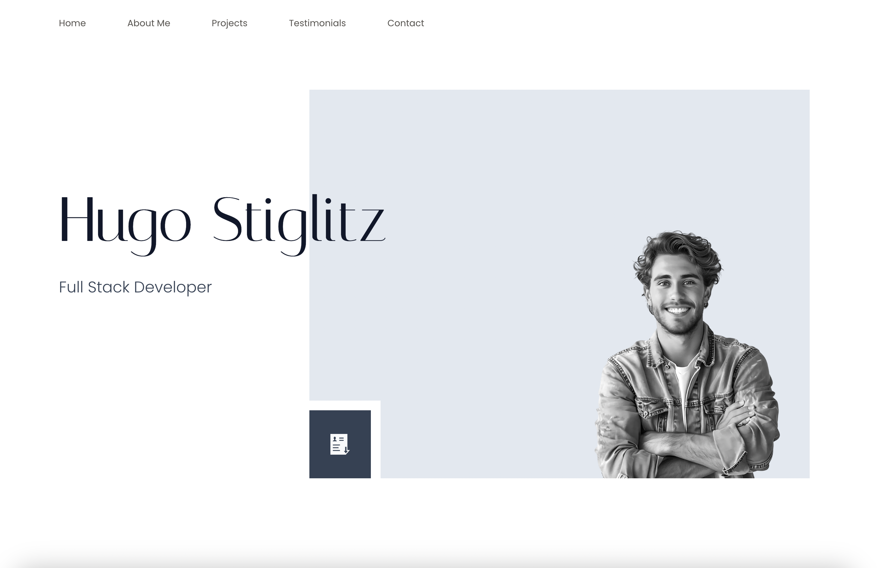
##

<br>

## How to use this documentation 📄
There are five sections and there will be specific instructions to modify each of them. 

#### First we should know a bit of tailwind. Follow the link if you have no idea and continue to read read.me --> https://tailwindcss.com/docs/installation

 - Your tailwind settings are already made so you do not need to do anything else than using basic css settings that tailwind provides if you want to make slight changes like colors, sizes, margins-paddings, etc.

 But how?

 - Just hit the quick search and ask whatever you need -->

 

 Lets say you want to change the colors; 

 Scroll throught the results and find customizing colors

 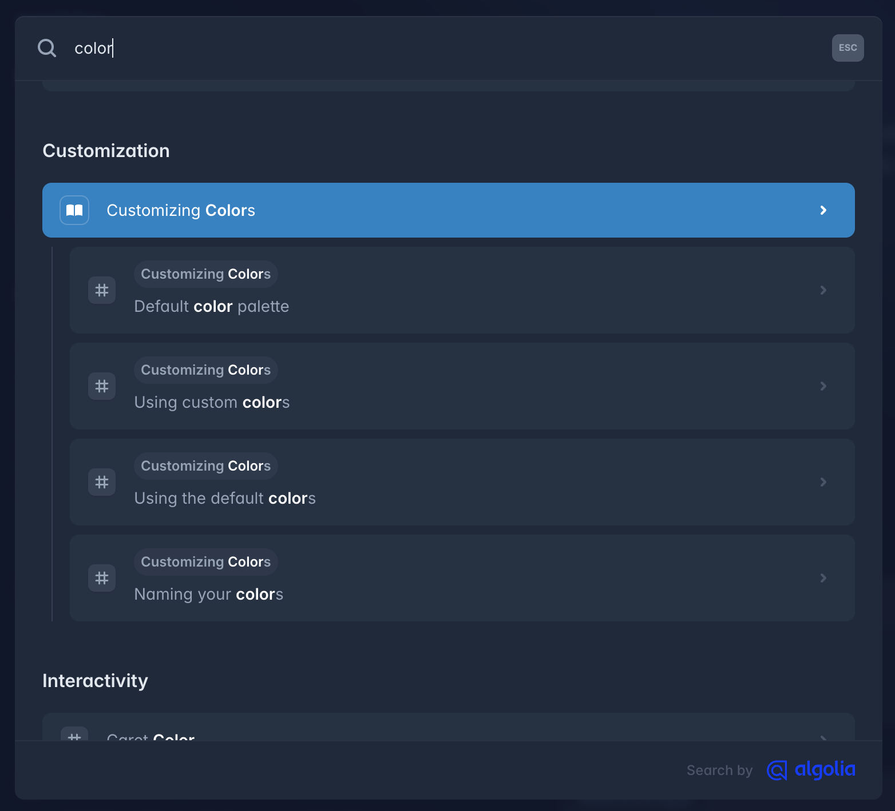

 <br>

All color codes ready for you, just type the name of the color and token code that you want and you are good to go. As an example "slate-50" would give us the color #f8fafc

In tailwind we declare the css with assigning a classname to element as below
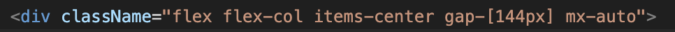
If we would add "background-slate-50" syntax on this element it would have slate 50 color bg.

<br>

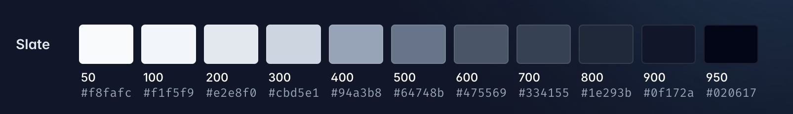

#### ✨ Important Hint: 

Let's say you do not remember the name of css flex setting what you are searching for. Do not try to find it for a decade scrolling inside the flex settings. Just ask to the gpt, copilot or gemini describing whatever you need. Believe me it will save so much time 🌚

Tailwind is much simpler than it seems, you will understand the most needed in 10-15min. But in this project changing the content is enough to have your personal portfolio 😉

<br>

#### Second let's get to know the sections and their content. -->

- Landing 🏠 <br>
A section featuring your name, title, profile picture, and a button to download your CV.
<br> 
<br>
- About 🙎‍♂️ <br>
On the left, provide a brief introduction about yourself along with a button linking to a dedicated page containing more detailed information about your story. On the right, showcase your achievements and the tech stack you’ve worked with.
<br> 
<br>
- Projects 📁 <br>
Showcase your top 3 projects, each with a brief description, a live preview link, and a GitHub button for code access.
<br> 
<br>
- Testimonials 💬 <br>
A slider featuring 3 testimonials, each including an image, title, LinkedIn link, and a quote from the testimonial giver.
<br>
<br>
- Contact 🤙🏻<br>
A section featuring your contact details, including Email, Github, and LinkedIn. Each has 2 button to copy the link and open to the link directly.
<br>
<br>

#### The section names and their content may seem complicated in the project files. No worries, lets check the folder structure together -->
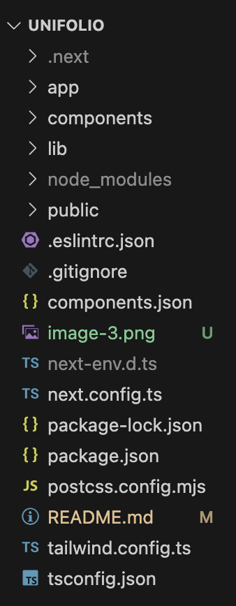
<br>
<br>

Inside the app folder, you will find the global files. In other words, these files set up the foundational structure, styles, and layouts used across the entire application.
<br>
<br>
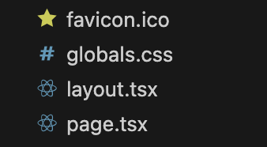
<br>

#### - global.css 
Here you can define theming(dark,light, etc.), add fonts, declare global rules and much more. If you will check it you will see many settings regarding our embla carousel that we are using for the testimonials section.

<br>

#### - layout.tsx
Normally handles the HTML structure and reusable UI components, not just styles. However in our case it renders just base global font definitions and html/body layout to keep it simple.

<br>

#### -page.tsx 
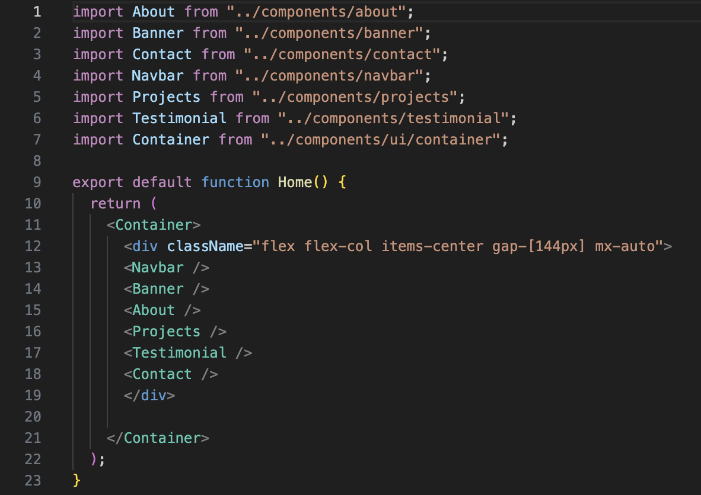
<br>

This one is our main page which renders everything. As you can see it includes everything that are rendered in the page from Navbar to Contact section in another container. It is the container that describes how whole sections will take position in the page. 

 #### ✨ Important Hint: 

If you just "ctrl + left mouse click (WINDOWS) " or " cmd + left mouse click (MAC)" you will see the code of that component. This is the easiest way to move between components.

<br>
<br>

## Section Specific Instructions &nbsp;  🌄

<br>

# Landing 🏠

Enter to components folder and find banner.tsx -->
<br>

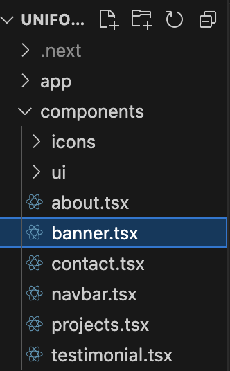

Top 2 lines indicate the css settings that are valid for all screen sizes. The other lines are very specific for different screen sizes.

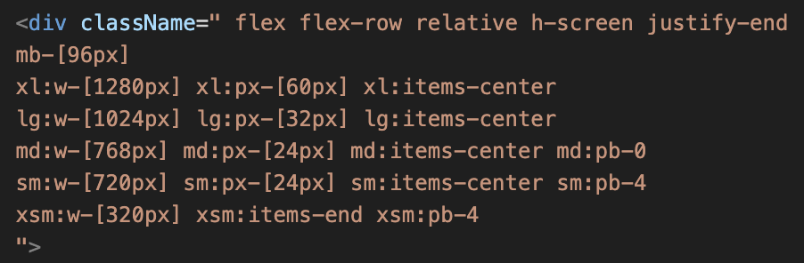

Hover your mouse to see css settings of the elements as below (if not working download the tailwind extension for vscode);

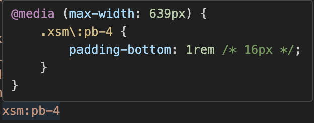

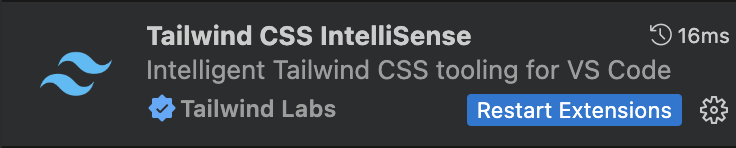

- To change your name and title find the element below:

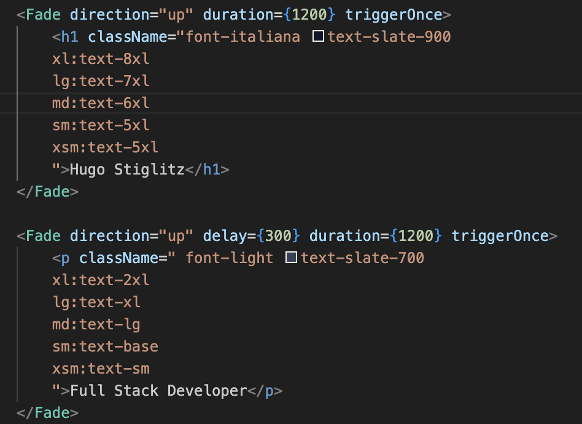

- To change your profile picture we will work together step by step:

If you have a cool png(a photo without background, in other words only you) profile pic just proceed to step 3 if not just follow the steps.

1- You need an img with a simple bg color as less color as simple it will ne to turn your jpeg, jpg, etc. formatted photo to png. You can simply get a selfie in front a wall.

2- Once your photo is ready, hit the link and access adobe free bg remover -->
https://www.adobe.com/express/feature/image/remove-background

<br>

Upload your photo


<br>

See this screen

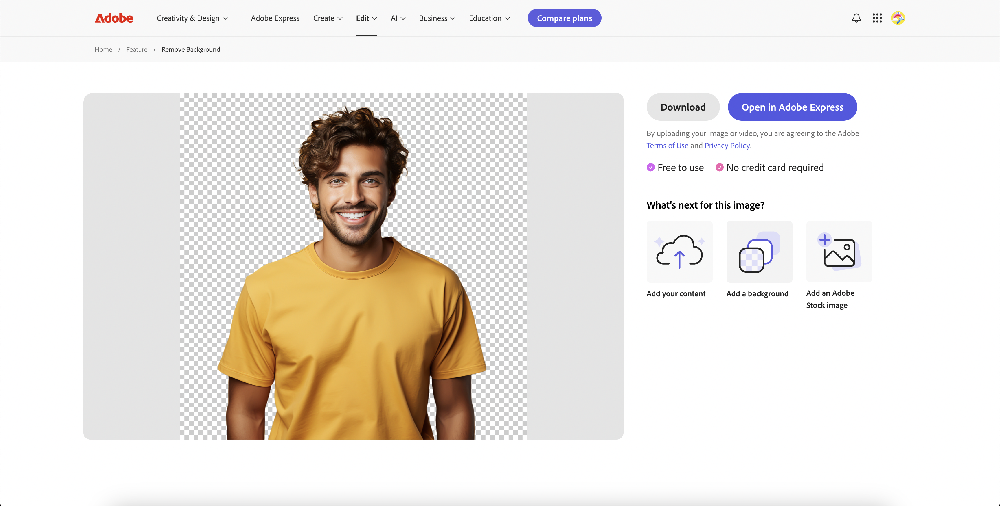

And hit download

Congrulations your png profile picture is ready 🎉

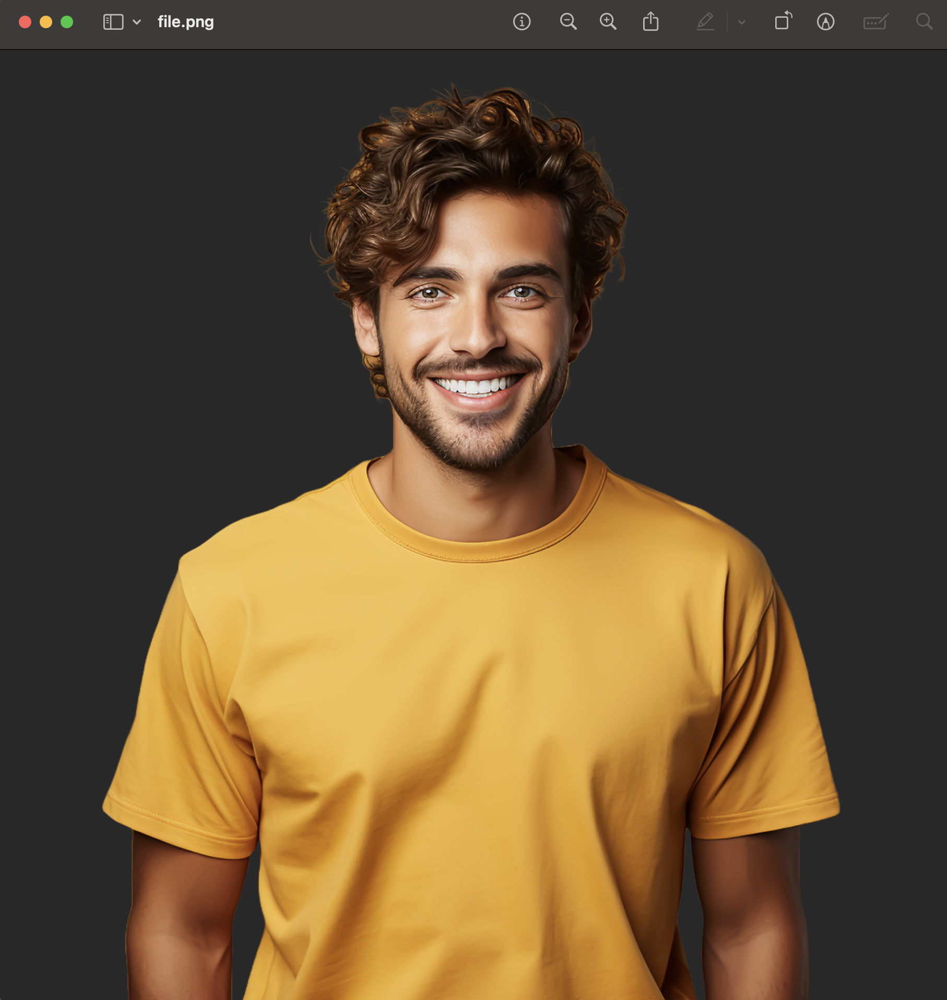

<br>

3- Now place your img inside the file named public

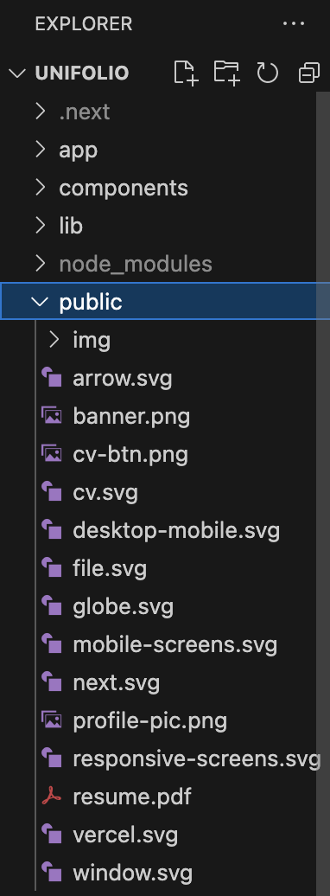

4- Copy the name of this file and delete it 

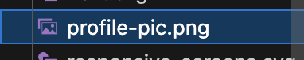

Now change name of your own profile picture with name that you just copied. You should be seeing it on the http://localhost:3000/, well done 👏🏻

Now inspect the page and check how responsive the photo is. If not, play with the numbers below. 

From the Image element under the breakpoint settings you can adjust the photo size also. If you want to use your photo name with other than profile-pic.png be sure that you adjust the src of img element accordingly. 

From the last line you can also declare very specific css settings directly for the photo.

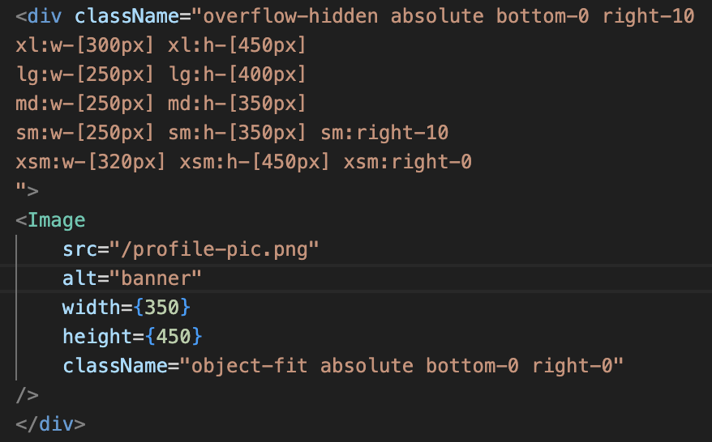

<br>

- Now lets add your CV to the button.

If you are not sure about your CV follow the link. Harvard format is one of the most preffered by recruiters as it is very simple to consider -->

https://careerservices.fas.harvard.edu/resources/bullet-point-resume-template/

If you want more authentic options, I recommend you to check the free CV templates of vecteezy -->

https://www.vecteezy.com/free-vector/cv?license-free=true

Once your CV is ready, add it to public folder and find the element below in banner.tsx :
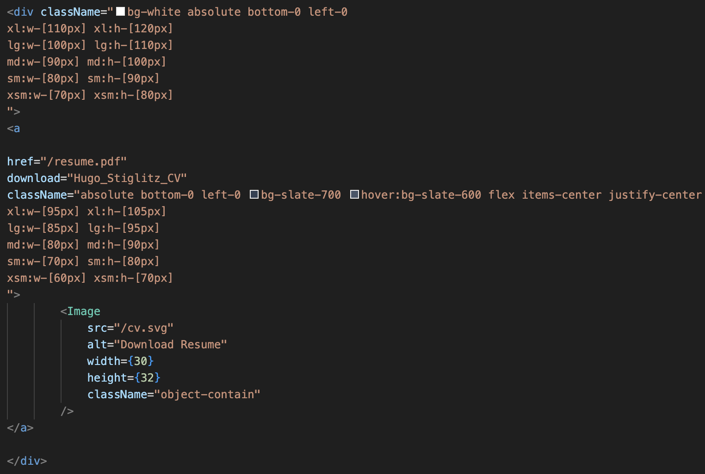

Adjust href according to your resume name 
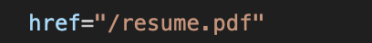

Congrulations your cv is ready to download, do not forget to check 😉

# 🎊 YOUR OWN LANDING IS READY 🎊


<!-- ## Technologies

- [Next.js](https://nextjs.org)
- [React](https://reactjs.org)
- [TypeScript](https://www.typescriptlang.org)


## Deployment

The easiest way to deploy your Next.js app is to use the [Vercel Platform](https://vercel.com/new?utm_medium=default-template&filter=next.js&utm_source=create-next-app&utm_campaign=create-next-app-readme) from the creators of Next.js.

Check out [Next.js deployment documentation](https://nextjs.org/docs/app/building-your-application/deploying) for more details. -->
