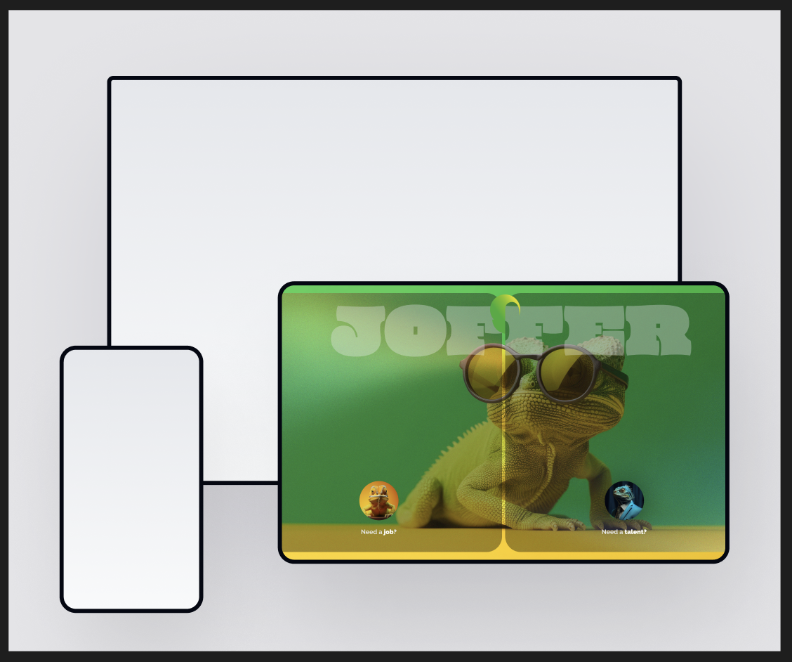
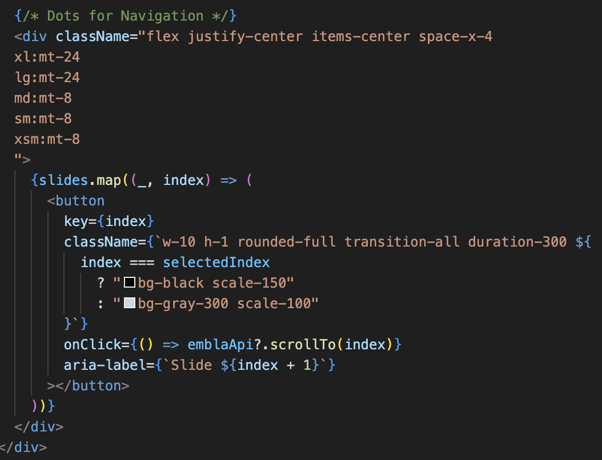
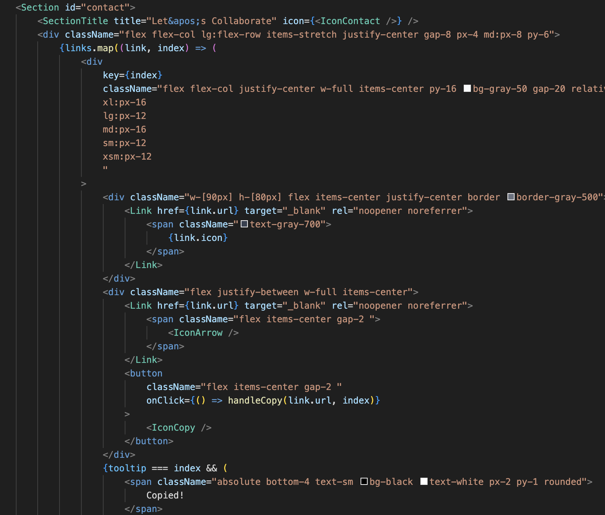

# Project Overview    📜 
 Unifolio is a customizable portfolio template tailored for university students and beginners. Inspired by advanced-level developer portfolios, project addresses common pain points and integrates insights from recruiters to meet their expectations effectively.

 ### Live Project Link: 

⭐️   https://unifolio-delta.vercel.app/  ⭐️
##

<br>
<br>

## Getting Started &nbsp;  ⚙️

<br>
First, install packages run the development server 

```bash
npm install && npm run dev
```

Open [http://localhost:3000](http://localhost:3000) with your browser to see the result.

If you see this, you are ready to start turning this template into your own portfolio 👌


##

<br>

## How to use this documentation 📄
There are five sections and there will be specific instructions to modify each of them. 

#### First we should know a bit of tailwind. Follow the link if you have no idea and continue to read read.me --> https://tailwindcss.com/docs/installation

 - Your tailwind settings are already made so you do not need to do anything else than using basic css settings that tailwind provides if you want to make slight changes like colors, sizes, margins-paddings, etc.

 But how?

 - Just hit the quick search and ask whatever you need -->

 

 Lets say you want to change the colors; 

 Scroll throught the results and find customizing colors

 

 <br>

All color codes ready for you, just type the name of the color and token code that you want and you are good to go. As an example "slate-50" would give us the color #f8fafc

In tailwind we declare the css with assigning a classname to element as below

If we would add "background-slate-50" syntax on this element it would have slate 50 color bg.

<br>


#### ✨ Important Hint: 

Let's say you do not remember the name of css flex setting what you are searching for. Do not try to find it for a decade scrolling inside the flex settings. Just ask to the gpt, copilot or gemini describing whatever you need. Believe me it will save so much time 🌚

Tailwind is much simpler than it seems, you will understand the most needed in 10-15min. But in this project changing the content is enough to have your personal portfolio 😉

<br>

#### Second let's get to know the sections and their content. -->

- Landing 🏠 <br>
A section featuring your name, title, profile picture, and a button to download your CV.
<br> 
<br>
- About 🙎‍♂️ <br>
On the left, provide a brief introduction about yourself along with a button linking to a dedicated page containing more detailed information about your story. On the right, showcase your achievements and the tech stack you’ve worked with.
<br> 
<br>
- Projects 📁 <br>
Showcase your top 3 projects, each with a brief description, a live preview link, and a GitHub button for code access.
<br> 
<br>
- Testimonials 💬 <br>
A slider featuring 3 testimonials, each including an public/readme-img/image, title, LinkedIn link, and a quote from the testimonial giver.
<br>
<br>
- Contact 🤙🏻<br>
A section featuring your contact details, including Email, Github, and LinkedIn. Each has 2 button to copy the link and open to the link directly.
<br>
<br>

#### The section names and their content may seem complicated in the project files. No worries, lets check the folder structure together -->

<br>
<br>

Inside the app folder, you will find the global files. In other words, these files set up the foundational structure, styles, and layouts used across the entire application.
<br>
<br>

<br>

#### - global.css 
Here you can define theming(dark,light, etc.), add fonts, declare global rules and much more. If you will check it you will see many settings regarding our embla carousel that we are using for the testimonials section.

<br>

#### - layout.tsx
Normally handles the HTML structure and reusable UI components, not just styles. However in our case it renders just base global font definitions and html/body layout to keep it simple.

<br>

#### -page.tsx 

<br>

This one is our main page which renders everything. As you can see it includes everything that are rendered in the page from Navbar to Contact section in another container. It is the container that describes how whole sections will take position in the page. 

 #### ✨ Important Hint: 

If you just "ctrl + left mouse click (WINDOWS) " or " cmd + left mouse click (MAC)" you will see the code of that component. This is the easiest way to move between components.

<br>
<br>

## Section Specific Instructions &nbsp;  🌄

<br>

# Landing 🏠

Enter to components folder and find banner.tsx -->
<br>


Top 2 lines indicate the css settings that are valid for all screen sizes. The other lines are very specific for different screen sizes.


Hover your mouse to see css settings of the elements as below (if not working download the tailwind extension for vscode);


- To change your name and title find the element below:


- To change your profile picture we will work together step by step:

If you have a cool png(a photo without background, in other words only you) profile pic just proceed to step 3 if not just follow the steps.

1- You need an img with a simple bg color as less color as simple it will ne to turn your jpeg, jpg, etc. formatted photo to png. You can simply get a selfie in front a wall.

2- Once your photo is ready, hit the link and access adobe free bg remover -->
https://www.adobe.com/express/feature/public/readme-img/image/remove-background

<br>

Upload your photo


<br>

See this screen


And hit download

Congrulations your png profile picture is ready 🎉


<br>

3- Now place your img inside the file named public


4- Copy the name of this file and delete it 


Now change name of your own profile picture with name that you just copied. You should be seeing it on the http://localhost:3000/, well done 👏🏻

Now inspect the page and check how responsive the photo is. If not, play with the numbers below. 

From the public/readme-img/Image element under the breakpoint settings you can adjust the photo size also. If you want to use your photo name with other than profile-pic.png be sure that you adjust the src of img element accordingly. 

From the last line you can also declare very specific css settings directly for the photo.


<br>

- Now lets add your CV to the button.

If you are not sure about your CV follow the link. Harvard format is one of the most preffered by recruiters as it is very simple to consider -->

https://careerservices.fas.harvard.edu/resources/bullet-point-resume-template/

If you want more authentic options, I recommend you to check the free CV templates of vecteezy -->

https://www.vecteezy.com/free-vector/cv?license-free=true

Once your CV is ready, add it to public folder and find the element below in banner.tsx :


Adjust href according to your resume name 


Congrulations your cv is ready to download, do not forget to check 😉

# 🎊 YOUR OWN LANDING IS READY 🎊

<br>

# About 🙎‍♂️

Enter to components folder and find about.tsx -->
<br>

When you first get in about.tsx may look crazy 🌚
<br>


No worries these are just icons of the tech stack that we worked with during the first 2 years at OAMK. You can see them sliding constantly under the achievements box of about section. Let's start with adjusting them -->

To delete one you can simply delete the whole line
<br>


The top import syntax should be also deleted, otherwise it will cause an error. To be more clear be sure that you delete this one too!


To  add one first you need the icon itself it can be either embed code of icon from tools like <a href="https://ionic.io/ionicons">ionicons </a>, <a href="https://fonts.google.com/icons?selected=Material+Symbols+Outlined:home:FILL@0;wght@400;GRAD@0;opsz@24&icon.size=24&icon.color=%23e8eaed">material icons</a>, etc.
or it can be the svg or png icon itself. For the render time, quality and file size one of the best and simplest option is to have an svg of the icon that we need.

<br>

#### But how you will find that svg tech icons?

We are eligible to get github student pack which makes many thing free for us 🤑. It gives us free access to <a href="https://icons8.com/icons">icon8 </a> also. here you can find huge amount of visual assets from icons to animated illusrations, high quality photos and even 3D Models. The best thing is you can download them in many different formats if you have premium which github student pack will give us for free 😉.

First thing first, go to your github account and get the student pack. 

https://education.github.com/pack

Once it is set (usually takes some hours to be approved but can take 1-2 days). Do not worry you will have it finally 👌 


When it's approved follow the link below and sign in.

https://icons8.com/github-students?utm_source=Github&utm_medium=hyperlink&utm_campaign=Github+Student+Pack


Congrats you have free access to thousands of free assets 👏🏻

Step by step, add an icon to tech stack that you have worked with -->

1- Lets say you want to add the icon of the c# 
Start by typing c# in the search bar


You will se many different options, you can be more precise with your search using the styles on the left bar.


I liked this one. This screen is to make your final styling adjustments before download.


When you hit download you will see the format settings. The settings on the screenshot are optimal for our project. Apply them and hit download or just copy the svg code at the bottom. As it will be SVG it will be fully customisable, in other words you will have chance to adjust them as the way that you wish. 


Your first icon is ready to embed 👍🏻

2- Firt we need svg code of your icon. We shared all the svg tech icons in the 

components -> icons -> svg-tech-icons


It is not a necessity to keep your icon itself in the project yet we need this code to create reausable .tsx components. To be safe for this project we kept all of them in svg-tech-icons folder, but after copying the code svg code, most probably you will never need the icon itself.


Once you copy the svg code of your icon(can be very long sometimes no worries)

Create a new file under icons with the name of "your icon name" + .tsx in my case it is c#.tsx.


3- Now we will turn that svg code to a reusable component 

Our c# file should look something like this but it should return it's own svg syntax and of course the names should be proper

 

You can just copy the code of azure.tsx(nothing special, it's just the shortest 😅) Paste it in the empty c# file that we created before and adjust the names on the top and bottom of the page. And delete the svg code of Azure. Should look something like this-->


Once you reach this paste svg code of c# 


Well done, you created your reusable component 🎊

4- Now we will place it in the about.tsx file head there and add this to code chunk that you see all other icons 


If the file is properly set, yor code editor should suggest the name. Once you hit enter it will automatically import the component that we created using the syntax below:


If you do not see it at the end of the imports it will cause an error, be sure it is imported! Look at the end.


If it is there you should be seeing c# scrolling with the rest of the elements 🙂. We deleted c# icon from the project, to give you possibility of trying by yoursefl ✌🏻 If you see this -->


Great you nailed it 🎉

The rest of the section is mostly to adjust text sizes we left opening for you for each paragraph in case you want to play with colors,sizes, etc. First two lines before the breakpoint settings are the general style settings. 


 #### ✨ Important Hint: 

The content that we provided is very generic. Adjust it based on the roles that you are applying, be very specific while explaining your story. 

About the acievements you do not need to show things only regarding coding, would be impressive if you add things indicating your communication, groupwork and international abilities.

<br>
<br>

Finally add your own link to the more of me button


Change the href with your own link. It can be a social media account, a simple page cool photos, etc. explaining your professional story shortly. 

<a href="https://www.oliviatruong.design/about">Olivia's</a> about page is a great example for this. You can replace her pro experience with your volunteering, coding projects, and educational experiences


If you did so...

# 🎊 YOUR ABOUT SECTION IS READY 🎊

<br>
<br>

# Projects 📁

Enter to components folder and find projects.tsx -->
<br>

First you will encounter with the project details we described under projects function. Adjust them with your own descriptions and links. If not the mockups your projects would be already done by just doing this 🙂


For the mockups there are several ways. 

First you can download some visuals from web and literally make your own mockups in photoshop watching tutorials(very time consuming 😴). 

Second you can use mock up generation tools like <a href="https://things.morflax.com/">Morflax</a>, <a href="https://www.canva.com/create/mockup-generator/">Canva</a>, or <a href="https://shots.so/">Shots</a>. My personal fav is <a href="https://shots.so/">Shots</a>. If you do soo add the img in the public folder 


and do not forget to change the img sources. 


You may need to fight with the settings like quality and sizes. It may cause high loading times if it will be too large file. My suggestion is to use a tool like <a href="https://squoosh.app/">Sqoosh</a> to convert your jpg, jpeg, png to webp and make the size smaller.

But even after that ensure the responsiveness of the img. Most probably you will see some problems. If so, you can adjust the size settings of the img elements. For this we kept the img in a holder div that you can adjust each img very precisely based on your needs. 


#### ✨ Third and easiest ✨ 

In public --> img folder you will find these svg imgs which you can directly copy to figma for adjustment.


Once you paste them in figma you will see something like this 


Left CLick on the screen that you want to adjust and fill it with the screen img that you want to use.




Once you are done select the frame that holding all the screens and hit on export at the bottom corner. SVG is the best option for us to export


If you export it with the same file names as they are in the project and add them in the public folder with deleting old ones. They will be ready in project without you making any extra quality or responsiveness setting 😉

Was easier than the previous sections isn't it? 😌

# 🎊 YOUR PROJECTS SECTION IS READY 🎊


<br>
<br>

# Testimonials 💬 

Enter to components folder and find testimonial.tsx -->
<br>

Seems much simpler than others at first glance 😅


If you are ok with just replacing the content with your own, there is nothing to worry about. We can say that your testmionial slider is ready 🙂

Most probably you will not need to do anything for the rest of the content for adjusting this section.

Just in case you might have a need of modifying, the amazing "ctrl + left mouse click (WINDOWS) " or " cmd + left mouse click (MAC)" hint enters the scene.

Apply this hint on the green element below to reach slider settings 


This will take you to another world 😅


Div on the top with breakpoint settings is the one that adjusting the main layout of the testimonials


This one is for the avatar settings 


And for the content 


Finally you can adjust the navigation dots



Hope you did not need them, but anyway -->

# 🎊 YOUR TESTIMONIAL SECTION IS READY 🎊


<br>

# Contact 🤙🏻

Enter to components folder and find contact.tsx -->
<br>

This is the easiest section among all there is nearly nothing to act on except colors and changing the links. If you will want to change the icon you already learned how to add one 🙂


Below you can see the links, that you are going to change with your own


We do not recommend to add more links if it will not create more impact with showcasing your professional skills. In case you want to add more just copy paste the line below and adjust with your own information.


After that you will already have your link added yet you will have to adjust the base css settings of your link through below:



About the buttons below:

This will directly head user to the link that you add


This will copy the link to clipboard


When we were making the research we noticed that these both could be a paint point for recruiters so we wanted have both options.

To adjust direct heading you can apply your changes here


For the copy you can adjust this one;


If everything is ready;

# 🎊 AMAZING, YOU ARE READY TO DEPLOY 🎊


<br>


<!-- ## Technologies

- [Next.js](https://nextjs.org)
- [React](https://reactjs.org)
- [TypeScript](https://www.typescriptlang.org)


## Deployment

The easiest way to deploy your Next.js app is to use the [Vercel Platform](https://vercel.com/new?utm_medium=default-template&filter=next.js&utm_source=create-next-app&utm_campaign=create-next-app-readme) from the creators of Next.js.

Check out [Next.js deployment documentation](https://nextjs.org/docs/app/building-your-application/deploying) for more details. -->
